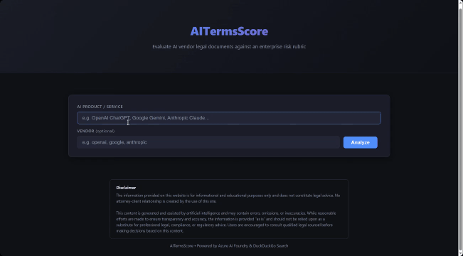
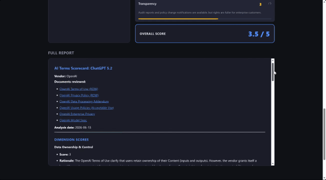

# AITermsScore

> **Built for the Microsoft Agent League competition.**

## The Problem

AI vendors publish Terms of Service, Privacy Policies, Data Processing Agreements, and Acceptable Use Policies that routinely run to 50+ pages of dense legal language. Enterprises and individuals adopting AI tools are expected to accept these documents — yet almost no one reads them. Hidden inside are clauses that grant vendors broad rights to train on your data, limit liability to a fraction of fees paid, give 30-day notice for unilateral changes, and provide no audit rights whatsoever.

**Most people click "I Agree" without knowing what they're agreeing to.**

## What AITermsScore Does

AITermsScore sends an AI agent to read those documents for you. Enter any AI product name in the browser. Within 2–3 minutes, the app returns a structured risk scorecard across 8 legal dimensions — rated 0–5, with citations from the actual documents — so you can compare vendors and understand your real exposure before signing up.

No legal background required. No manual document hunting. Just a score you can act on.

---

## Demo

### 1. Enter a Model



### 2. View the Score


### 3. View the Details



---

## How It Works (Technical)

An **Azure AI Foundry Agent** backed by **GPT-4.1** autonomously searches the web for the vendor's current legal documents using **DuckDuckGo**, applies a configurable risk rubric across 8 dimensions, and streams a live scorecard back to the browser via Server-Sent Events. The result includes per-dimension scores (0–5), rationale, key findings, a letter grade, and a full written report.

```
Browser (index.html)
      │  POST /score  { product_name, vendor }
      ▼
app.py (Flask)  ──── spawns background thread
      │
      ▼
config.py  ──── reads env vars, locates rubric + system prompt files
      │
      ▼
agent/setup.py  ──── connects to Azure AI Foundry via DefaultAzureCredential
      │               returns agent stub (AGENT_ID env var) or creates agent
      ▼
agent/runner.py  ──── creates thread → posts user message → create_and_process()
      │                Agent searches the web with DuckDuckGo, applies the rubric,
      │                returns a Markdown scorecard + trailing JSON scores block
      ▼
app.py  ──── parses scores, streams SSE events back to browser
      │       { type: "status" | "done" | "error" }
      ▼
output_writer.py  ──── writes output/<timestamp>_<product>.{md,json,html}
```

### Key components

| File | Purpose |
|---|---|
| `app.py` | Flask web server — HTTP routes, SSE streaming, background job queue |
| `config.py` | Reads and validates all environment variables |
| `agent/setup.py` | Connects to Azure AI Foundry, returns the agent (fast path on App Service) |
| `agent/runner.py` | Creates an agent thread, runs it, parses the scorecard JSON from the response |
| `output_writer.py` | Persists scorecards to `.md`, `.json`, and `.html` files |
| `prompt/system_prompt.md` | Agent system instructions — controls scoring strategy and output format |
| `rubric/ai_terms_risk_rubric.v1.0.0.json` | Scoring rubric — dimensions, weights, scale definitions |
| `templates/index.html` | Single-page web UI — form, live status stream, scorecard rendering |
| `startup.sh` | App Service startup script — activates Oryx virtualenv, launches gunicorn |
| `infra/main.bicep` | Azure infrastructure definition (App Service Plan, Web App, App Insights) |
| `azure.yaml` | Azure Developer CLI (`azd`) service definition |

---

## Local Development

### Prerequisites

| Requirement | Notes |
|---|---|
| Python 3.12 | `python --version` |
| Azure CLI | `az login` with an account that has **Azure AI Developer** on the Foundry project |

### Setup

```powershell
# 1. Create and activate virtual environment
python -m venv .venv
.venv\Scripts\Activate.ps1

# 2. Install dependencies
pip install -r requirements.txt

# 3. Configure environment
Copy-Item .env.example .env
# Edit .env — see variables table below
```

### Environment variables (`.env`)

| Variable | Required | Where to find it |
|---|---|---|
| `AZURE_AI_PROJECT_ENDPOINT` | ✅ | AI Foundry portal → your project → Overview → **Project endpoint** · Format: `https://<hub>.services.ai.azure.com/api/projects/<project>` |
| `AZURE_AI_MODEL_DEPLOYMENT` | ✅ | AI Foundry portal → your project → **Deployments** → deployment name (e.g. `gpt-4.1`) |
| `AGENT_NAME` | optional | Name to register the agent under. Defaults to `AITermsScoreAgent` |
| `AGENT_ID` | optional | If set, the app skips all agent API calls and uses this ID directly. Recommended for App Service. |
| `TRACE_SDK_CALLS` | optional | Set to `1` to emit per-call Azure SDK timing lines (e.g. `[trace] runs.get: 742 ms`) into the live status stream. Default `0`. |

### Run locally

```powershell
python app.py
# Open http://localhost:5000
```

### CLI (optional)

```powershell
# Score a product
python main.py score "OpenAI ChatGPT"
python main.py score "Google Gemini" --vendor google --timeout 600

# Delete the registered agent from AI Foundry
python main.py delete-agent
```

---

## Azure Deployment

The app deploys to **Azure App Service (Linux)** using the Azure Developer CLI (`azd`).

### Prerequisites

| Requirement | Notes |
|---|---|
| Azure Developer CLI (`azd`) | [Install guide](https://learn.microsoft.com/azure/developer/azure-developer-cli/install-azd) |
| Azure CLI (`az`) | `az login` |
| Contributor role on the target resource group | To create and update resources |

### First-time deploy

```powershell
# Authenticate
az login
azd auth login

# Set required environment values
azd env set AZURE_SUBSCRIPTION_ID   <your-subscription-id>
azd env set AZURE_LOCATION          eastus
azd env set AZURE_AI_PROJECT_ENDPOINT "https://<hub>.services.ai.azure.com/api/projects/<project>"
azd env set AZURE_AI_MODEL_DEPLOYMENT gpt-4.1

# Provision infrastructure + deploy code
azd up
```

`azd up` will:
1. Create an **App Service Plan (B1 Basic, Linux)** and a **Web App** in your resource group
2. Enable a **System-Assigned Managed Identity** on the Web App
3. Create **Application Insights** and a **Log Analytics Workspace**
4. Build the Python app with Oryx and deploy it

### Required Azure app settings

These are set automatically by `azd up` via `infra/main.bicep`. If you need to update them manually:

```powershell
az webapp config appsettings set \
  --name <web-app-name> \
  --resource-group <resource-group> \
  --settings \
    AZURE_AI_PROJECT_ENDPOINT="https://<hub>.services.ai.azure.com/api/projects/<project>" \
    AZURE_AI_MODEL_DEPLOYMENT="gpt-4.1" \
    AGENT_ID="<your-agent-id>" \
    TRACE_SDK_CALLS="0" \
    WEBSITES_PORT="8000" \
    SCM_DO_BUILD_DURING_DEPLOYMENT="true"
```

| App Setting | Purpose |
|---|---|
| `AZURE_AI_PROJECT_ENDPOINT` | AI Foundry project endpoint URL |
| `AZURE_AI_MODEL_DEPLOYMENT` | Model deployment name |
| `AGENT_ID` | Pre-registered agent ID — bypasses `list_agents` / `create_agent` API calls on startup. Find it in AI Foundry portal → your project → **Agents**. |
| `TRACE_SDK_CALLS` | Optional diagnostics toggle. `1` adds SDK timing lines to SSE status output; `0` disables it. |
| `WEBSITES_PORT` | Must be `8000` — tells App Service to route traffic to gunicorn's port |
| `SCM_DO_BUILD_DURING_DEPLOYMENT` | Must be `true` — tells Oryx to run `pip install` at deploy time, not at cold-start |

### Required IAM role assignments

The Web App's **System-Assigned Managed Identity** must have the following roles on your Azure AI Foundry resource:

| Role | Scope | Why |
|---|---|---|
| **Azure AI Developer** | AI Foundry account or project | Create threads, post messages, run agents |
| **Azure AI User** | AI Foundry account | Read model deployments |

To assign (replace `<principal-id>` with the managed identity principal ID from `azd up` output or the portal):

```powershell
# Get the resource ID of your AI Foundry account
$accountId = az cognitiveservices account show \
  --name <foundry-account-name> \
  --resource-group <resource-group> \
  --query id -o tsv

# Assign Azure AI Developer
az role assignment create \
  --assignee <principal-id> \
  --role "Azure AI Developer" \
  --scope $accountId

# Assign Azure AI User
az role assignment create \
  --assignee <principal-id> \
  --role "Azure AI User" \
  --scope $accountId
```

### Redeploy after code changes

```powershell
azd deploy
```

### Optional diagnostics: trace Azure SDK timings

Use this when debugging run latency or polling behavior.

```powershell
# Enable trace lines in SSE status stream
az webapp config appsettings set \
  --name <web-app-name> \
  --resource-group <resource-group> \
  --settings TRACE_SDK_CALLS="1"

# Disable after troubleshooting
az webapp config appsettings set \
  --name <web-app-name> \
  --resource-group <resource-group> \
  --settings TRACE_SDK_CALLS="0"
```

---

## Output

Scorecards are written to `output/` locally or `/home/output/` on App Service (persisted storage):

```
output/
  20260301T123456Z_openai_chatgpt.md
  20260301T123456Z_openai_chatgpt.json
  20260301T123456Z_openai_chatgpt.html
```

### JSON schema

```json
{
  "product_name": "OpenAI ChatGPT",
  "vendor": "openai",
  "generated_utc": "20260301T123456Z",
  "run_id": "...",
  "thread_id": "...",
  "scores": {
    "data_privacy":      { "score": 3, "notes": "..." },
    "data_security":     { "score": 4, "notes": "..." },
    "ip_ownership":      { "score": 2, "notes": "..." },
    "acceptable_use":    { "score": 4, "notes": "..." },
    "liability":         { "score": 2, "notes": "..." },
    "vendor_lock_in":    { "score": 3, "notes": "..." },
    "overall": 3.0
  },
  "raw_markdown": "..."
}
```

Scores are on a **0–5 scale**: 0 = highest risk, 5 = lowest risk.

---

## Customisation

### Scoring rubric

Edit [`rubric/ai_terms_risk_rubric.v1.0.0.json`](rubric/ai_terms_risk_rubric.v1.0.0.json) to add, remove, or reweight dimensions. The rubric is embedded into the agent's system prompt at startup.

### Agent instructions

Edit [`prompt/system_prompt.md`](prompt/system_prompt.md) to change the agent's search strategy, scoring approach, or report format.

---

## Project Structure

```
getAITermsScore/
├── .env.example              ← copy to .env and fill in your values
├── .python-version           ← pins Python 3.12
├── requirements.txt
├── config.py                 ← env var loading and validation
├── app.py                    ← Flask web server + SSE streaming
├── main.py                   ← optional CLI (click)
├── output_writer.py          ← writes .md / .json / .html scorecards
├── startup.sh                ← App Service startup (activates venv, runs gunicorn)
├── azure.yaml                ← azd service definition
├── agent/
│   ├── setup.py              ← connect to AI Foundry, return agent
│   └── runner.py             ← run scoring thread, parse scorecard
├── prompt/
│   └── system_prompt.md      ← agent instructions
├── rubric/
│   └── ai_terms_risk_rubric.v1.0.0.json
├── templates/
│   └── index.html            ← web UI
├── infra/
│   ├── main.bicep            ← Azure infrastructure (App Service, App Insights)
│   └── main.parameters.json  ← azd parameter bindings
└── output/                   ← generated scorecards (git-ignored)
```

---

## Disclaimer

The information provided by this application is for informational and educational purposes only and does not constitute legal advice. No attorney‑client relationship is created by the use of this application. Content is generated and assisted by artificial intelligence and may contain errors, omissions, or inaccuracies. Users are encouraged to consult qualified legal counsel before making decisions based on this content.
